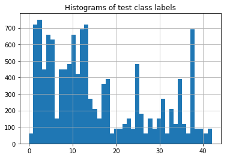
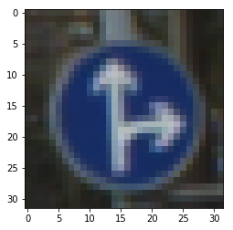
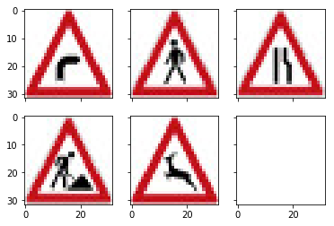

**Traffic Sign Recognition** 

In this project, we build a CNN classifier to recognize traffic signs. A Jupyter Notebook with all the code to preform this task is included [here](Traffic_Sign_Classifier.ipynb). In what follows I summarize the data preparation and classifier training and evaluation procedure. 

### Data Set Summary & Exploration

1. I loaded the provided training/validation/test files and extracted features and labels as NumPy arrays. I used the Python & NumPy functions "len", "shape", & "unique" to collect the following summary about the data. 

* The size of training set is 34799
* The size of the validation set is 4410
* The size of test set is 12630
* The shape of a traffic sign image is 32X32X3
* The number of unique classes/labels in the data set is 43

2. Example images from the dataset.

  

  

  

### Building a CNN Classifier

1. Data Preprocessing
* I converted images to grayscale by taking a weighted sum of the three color channels. The weights for the RGB channels are 0.299, 0.587, 0.114, respectively. Working on one channel instead of three improve the model's prediction accuracy. It prevents the model from overfitting the color artificats where the information in one channel is sufficient to classifiy the traffic signs effectively. Also, the training speed increases by utilizing less number of parameters in the first convolution layer.

* After converting the images to gray-scale, I normalized them by subtracting 128 from all pixels and dividing the result by 128. The value 128 is half the maximum number of pixel intensities 256.

* The difference between the original data set and the augmented data set is around 10% in terms of prediction accuracy on the validation set.

2. Model Architecture

My final model consisted of the following layers:

| Layer         		|     Description	        					| 
|:---------------------:|:---------------------------------------------:| 
| Input         		| 32x32x1 Gray scale image   							| 
| Convolution 5x5     	| 1x1 stride, VALID padding, outputs 28x28x6 	|
| RELU					|												|
| Max pooling	      	| 2x2 stride,  outputs 14x14x6 				|
| Convolution 5x5	    | 1x1 stride, VALID padding, outputs 10x10x16		|
| RELU					|												|
| Max pooling	      	| 2x2 stride,  outputs 5x5x16 				|
| Fully connected		| 400X120        									|
| Fully connected		| 120X84        									|
| Fully connected		| 84X43        									|
| Softmax				| 43        									|
|						|												|
|						|												|
 
3. Training the Model

To train the model, I used Adam optimizer that minimizes a loss function defined as the mean cross entropy between predicted class probabilities and true labels. The optimization procedure prosceeds as follows. The training data is divided into small 128-example batches. For each batch, the optimizer is invoked to predict the probabilities of the 128 traffic signds and the error between the predictions and true labels are used to compute the gradient. The gradient is then applied by the optimizer to update the parameters of the model. The magintue of the update is a function of the magnitude of the gradient and the learning rate which I set to 0.001. The next batch is then passed to the optimizer to perform the same forward and backward passes of prediction gradient back probagation. After completeing the last batch, the entire process (epoch) is repeated on the whole dataset over and over again. I trained the network for a total of 150 epochs.     

Upon completing the 150-th training epoch, my final model results were:
* training set accuracy of 1.0 (i.e. 100%)
* Validation set accuracy of 0.957.
* test set accuracy of 0.943.

### Classification Accuracy

I downloaded five random traffic sign images from here https://en.wikipedia.org/wiki/Road_signs_in_Germany and evaluated the CNN model on them. the classifier recognized 4 out of 5 correctly (80% accuracy). 

  

Here are the results of the prediction:

| Image			        |     Prediction	        					| 
|:---------------------:|:---------------------------------------------:| 
| Dangerous curve to the right     		| Dangerous curve to the right					| 
| Pedestrians    			| General caution	|
| Road narrows on the right     			| Road narrows on the right 										|
| Road work				| Road work				|
| Wild animals crossing  		| Wild animals crossing				|

I get almost 1.0 probability for each predicted image except the misclassified sign (Pedestrians) for which the certainity of the model is 0.92 given mistakenly to General Caution sign. The second largest probability of this image is 0.0789 and was assigned to the correct class label of Pedestrians.   
For the first image, the model is certain that this is a Dangerous curve to the right sign (probability of 1.0), and the image does contain a Children Crossing sign. The top five soft max probabilities were

| Probability         	|     Prediction	        					| 
|:---------------------:|:---------------------------------------------:| 
| 1.0     		| Dangerous curve to the right					| 
| 0.92    			| General caution	|
| 1.0     			| Road narrows on the right 										|
| 1.0				| Road work				|
| 1.0  		| Wild animals crossing				|

